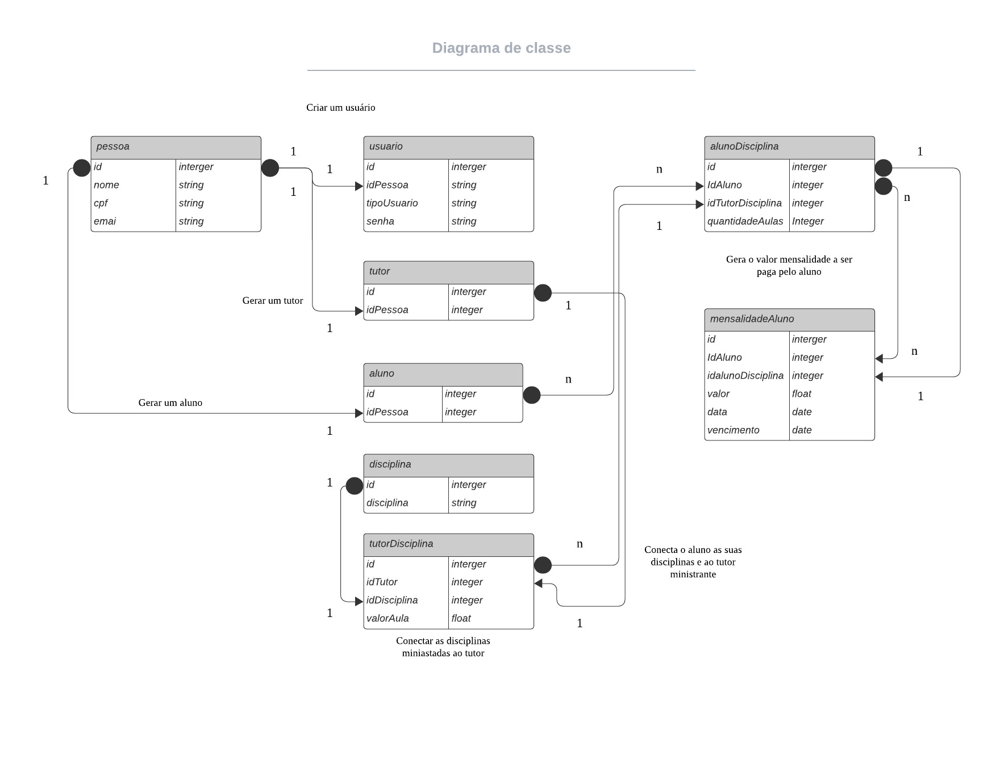
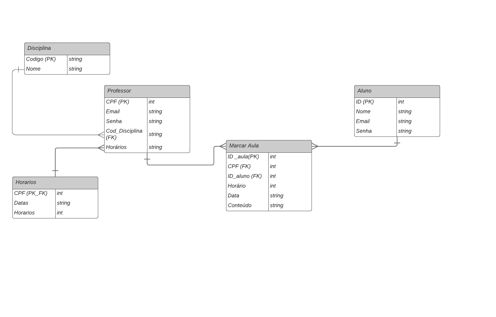

# Arquitetura da Solução

Pré-requisitos: <a href="3-Projeto de Interface.md"> Projeto de Interface</a>

Definição de como o software é estruturado em termos dos componentes que fazem parte da solução e do ambiente de hospedagem da aplicação.

O modelo utilizando aqui sera o MVC (model - view - controller), o principal conceito aborodado por esse modelo é fazer a utilização de uma solução já definidade para que partes distiandas do projeto sejam separadas e com isso reduzir ao máximo suas dependencendias.
Definindo as partes deste modelo temos primeiramentre o model, que tem a resonsabilidade dos models e representar o negíocio, essa parte também é responsável pela manipulção e acessos de dados utilizados na aplicação. A view é demonstrada como a interface apresentada ao usuário e apresenta informações do model ao usuário. Por fim temos o controller que é a camada de controle, ela liga o model ao view fazendo com que os models possam ser repassados para as views e também o caminho inverso.

## Diagrama de Classes

O diagrama de classes ilustra graficamente como será a estrutura do software, e como cada uma das classes da sua estrutura estarão interligadas. Essas classes servem de modelo para materializar os objetos que executarão na memória.
Abaixo segue o diagrma de classe elaborado para experssar este projeto:

## Modelo ER

## Esquema Relacional

## Modelo Físico (DDL)

Entregar um arquivo banco.sql contendo os scripts de criação das tabelas do banco de dados. Este arquivo deverá ser incluído dentro da pasta src\bd.

## Instruções SQL de Manipulação do BD (DML)

Entregar um arquivo dml.sql contendo os scripts de manipulação de banco de dados. Este arquivo deverá ser incluído dentro da pasta src\bd.

## Tecnologias Utilizadas

Descreva aqui qual(is) tecnologias você vai usar para resolver o seu problema, ou seja, implementar a sua solução. Liste todas as tecnologias envolvidas, linguagens a serem utilizadas, serviços web, frameworks, bibliotecas, IDEs de desenvolvimento, e ferramentas.

## Tecnologias Utilizadas

Descreva aqui qual(is) tecnologias você vai usar para resolver o seu problema, ou seja, implementar a sua solução. Liste todas as tecnologias envolvidas, linguagens a serem utilizadas, serviços web, frameworks, bibliotecas, IDEs de desenvolvimento, e ferramentas.

# As tecnologias que serão utilizadas são:
| Linguagems de programação ou marcação  | FRAMEWORK           | SISTEMAS      | IDLS               |           
|     -------------                      | -------------       | ------------- | -------------      |       
| C Sharp                                | .NET Framework 8.0  |  WINDOWNS     |  VISUAL STUDIO     |       
| Java Script                            |   BOOTSTRAP         |  LINUX        | VISUAL STUDIO CODE | 
| HTML5                                  |  JQUERY             |  MAC          |                    | 
| CSS3                                   |                     |  ANDROID      |                    | 

| BIBLIOTECAS DO .NET                               |           
|        -------------                              |
| Microsoft.EntityFrameworkCore                     |
| Microsoft.EntityFrameworkCore.Tools               |
| MySql.EntityFrameworkCore                         |
| Microsoft.AspNetCore.Mvc.Razor.RuntimeCompilation |
| Microsoft.EntityFrameworkCore.SQLite              |
| Microsoft.EntityFrameworkCore.SqlServer           |
| Microsoft.EntityFrameworkCore.Design              |
| Microsoft.VisualStudio.Web.CodeGeneration.Design  |

---

---
Apresente também uma figura explicando como as tecnologias estão relacionadas ou como uma interação do usuário com o sistema vai ser conduzida, por onde ela passa até retornar uma resposta ao usuário.

## Hospedagem

A plataforma será hospedada em localhost, por se tratar de um projeto apenas para estudo da tecnologia ASP.NET

> **Links Úteis**:
>
> -  [Website com GitHub Pages](https://pages.github.com/)
> -  [Programação colaborativa com Repl.it](https://repl.it/)
> -  [Getting Started with Heroku](https://devcenter.heroku.com/start)
> -  [Publicando Seu Site No Heroku](http://pythonclub.com.br/publicando-seu-hello-world-no-heroku.html)
